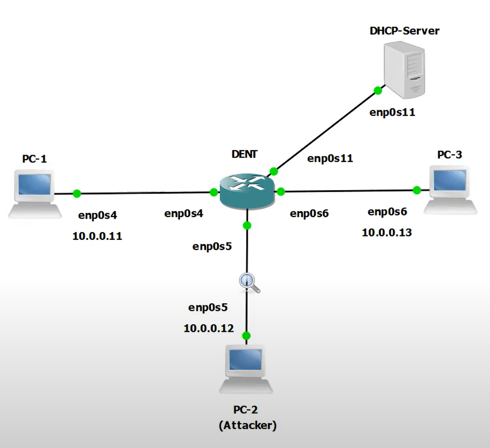

# Dynamic ARP Inspection

As many are aware, the Address Resolution Protocol (ARP) is used to map IP addresses to MAC addresses within a local area network (LAN). However, traditional network stacks do not verify the authenticity of ARP messages. This lack of validation exposes systems to ARP cache poisoning, a technique used to redirect traffic via man-in-the-middle (MITM) attacks, perform denial-of-service (DoS), or facilitate data theft.

Enterprise-grade switches often offer Dynamic ARP Inspection (DAI) as a Layer 2 security feature to mitigate such risks. However, Linux-based networking environments have lacked an equivalent - until now. To fill this gap, we developed **KDAI** (Kernel Dynamic ARP Inspection), a Linux kernel module that implements DAI.

## KDAI

**KDAI** is a Loadable Kernel Module (LKM) for Linux systems that enhances Layer 2 network security by preventing ARP cache poisoning attacks. It operates by intercepting ARP messages traversing a Linux bridge and comparing ARP entries against a trusted database of IP-to-Mac address bindings. This database is built dynamically using DHCP Snooping but may also be populated using static ARP entries.

### Key Features of KDAI

### ARP Inspection

KDAI **inspects** all ARP packets received on a Linux bridge in order to log ARP traffic and drop packets with mismatched or unauthorized IP-to-MAC bindings. This inspection helps defend against ARP spoofing and MITM attacks.

---

### DHCP Snooping

Another key feature of KDAI is its DHCP snooping. KDAI builds a **dynamic DHCP snooping table** by monitoring DHCP traffic crosing over a Linux bridge. This table records DHCP requests to form trusted IP-to-MAC address bindings. Incoming ARP packets are validated against this table to ensure their authenticity.

---

### ARP Access Control Lists (ACLs)

KDAI also supports **static ARP ACLs** configured via the system's local ARP table. Administrators can manually add valid IP-to-MAC bindings to compare incoming ARP packets against static ARP entries.

For example, to add a static ARP entry binding the IP address `10.0.0.11` to the MAC address `0c:97:c8:4a:00:01` on interface `enp0s4`, when the module is installed use:

```bash
sudo arp -s 10.0.0.11 0c:97:c8:4a:00:01 -i enp0s4
```

---

### Trusted vs. Untrusted Interfaces

Furthermore, when using KDAI, each interface can be explicitly marked as either:

- **Trusted**: ARP traffic bypasses any checks.
- **Untrusted**: All ARP packets are subject to Dynamic ARP Inspection.

This allows selective enforcement of ARP validation policies across the network.

---

### ARP Rate Limiting

To mitigate ARP flooding, KDAI also enforces **rate limiting**. The default limit is **15 ARP packets per second** on untrusted interfaces.

---

### Per-VLAN Support

KDAI operates on a **per-VLAN basis**, making it suitable for deployment in VLAN-segmented environments. This means that trusted interfaces, rate limits, and inspection rules are all applied independently for each VLAN, allowing for granular enforcement across network segments.

---

## Building and Installing

### Prerequisites

Before building and installing **KDAI**, ensure your system meets the following requirements.

### 1. Kernel Configuration

KDAI requires a Kernel Configuration with the following options enabled (either built-in or as modules):

- **CONFIG_MODULES** – Provides support for loadable kernel modules.
- **CONFIG_IP_NF_ARPFILTER** – Allows ARP packet filtering via Netfilter.
- **CONFIG_BRIDGE_NETFILTER** – Allows IP and ARP filtering on bridged traffic.

If you are unsure whether the following options are enabled try using the following command to view your current Kernel Configuration options:

```bash
zcat /proc/config.gz | grep -E "CONFIG_MODULES|CONFIG_IP_NF_ARPFILTER|CONFIG_BRIDGE_NETFILTER"
```

The Kernel Configurations are enabled if you see the following ouput:

```bash
CONFIG_MODULES=y
CONFIG_IP_NF_ARPFILTER=y
CONFIG_BRIDGE_NETFILTER=y
```

If you do not see the above this means your kernel could be missing one or more of the following configuraitons. In this case, you would need to recompile your kernel with the above either enabled or as loadable modules.

### 2. Install Linux Headers

### Linux Kernel Headers

In order to build the module you need to have your systems Linux kernel headers available.

On most systems, the Linux Kernel headers can be found under:

```bash
/lib/modules/$(uname -r)/build/
```

For example, you should see an output similar to the following:

```bash
root@localhost:~# ls /lib/modules/$(uname -r)/build/
arch  drivers  include  Makefile  Module.symvers  scripts  System.map  tools

```

If the above Kernel Headers are missing, please install them.

On Debian/Ubuntu, you can install the headers with:

```bash
sudo apt-get install linux-headers-$(uname -r)
```

_**NOTE:** If you built **DENT** from [source](https://github.com/dentproject/dentOS), you may locate the headers in the DENT
repo following a similar directory structure as below._

The following is an example built with onl-kernel-5.6-lts-x86-64-all_amd64. The linux kernel headers can be found in the `mbuilds` directory:

```bash
root@localhost:~/dentOS/REPO/buster/extracts/onl-kernel-5.6-lts-x86-64-all_amd64/usr/share/onl/packages/amd64/onl-kernel-5.6-lts-x86-64-all$ ls
kernel-5.6-lts-x86_64-all  mbuilds  mbuilds.zip
```

In order to build the module on DENT copy over the directory content of `mbuilds` to `/lib/modules/$(uname -r)/build/` on to your DENT device.

For example:

```bash
scp -r mbuilds/ user@dent-device:/lib/modules/$(uname -r)/build/
```

### 3. GCC Compiler

Finally ensure you have installed **GCC** version `5.4.0` or later to compile the kernel module.

On most devices you can check your **GCC** version with:

```bash
gcc --version
```

To install **GCC** use:

```bash
sudo apt-get install gcc
```

### Steps for Installation

1. Once the prerequisites are satisfied, go to the associated GitHub repository and clone the repo to your device.

   ```bash
   root@localhost:~# git clone https://github.com/dentproject/kdai.git
   Cloning into 'kdai'...
   remote: Enumerating objects: 898, done.
   remote: Counting objects: 100% (269/269), done.
   remote: Compressing objects: 100% (124/124), done.
   remote: Total 898 (delta 181), reused 200 (delta 131), pack-reused 629 (from 2)
   Receiving objects: 100% (898/898), 317.70 KiB | 24.00 KiB/s, done.
   Resolving deltas: 100% (540/540), done.

   root@localhost:~# ls
   kdai
   ```

2. Build the module using the following command:

   ```bash
   make all
   ```

3. Install the module using the following command:
   ```bash
   make install
   ```

**Congratulations! You have Succesfully built and installed KDAI!**

### Additional commands

1. To unload the module...

```bash
make remove
```

2. To remove all created files

```bash
make clean
```

---

## KDAI Kernel Module Configuration Parameters

KDAI supports dynamic configuration using Kernel Module Parameters. This means you can change the functionality
of the kernel module while it is loaded. This feature is especially useful for configuring which VLANs to inspect, assigning
trusted interfaces, enabling DAI inspection for all packets under a single VLAN, and enforcing static ACLs.

While this document covers multiple configuration options, if you're just getting started with KDAI, it’s recommended to focus first on the VLANs To Inspect List.

### VLANs To Inspect List

The VLANs to Inspect list determines when the module will actually perform Dynamic ARP Inspection. When loaded, the module remains idle until this configuration parameter is specified. The reason for this is because Dynamic ARP Inspection works on a per VLAN basis. As a result, the module enforces Dynamic ARP Inspection only on VLANs that are specified. By default, this list is empty, which means no ARP Inspection is performed.

To Add a VLAN to the VLANs To Inspect list use the following command:

```bash
echo "${VLAN_ID}" | sudo tee /sys/module/kdai/parameters/vlans_to_inspect
```

The `{$VLAN_ID}` represents an integer for the VLANs on which the kernel module will inspect traffic on.

Ex.

By default, VLAN 1 is the native VLAN on many types of network equipment. This means that any untagged traffic that hits a switch port is considered part of VLAN 1. So to inspect any untagged traffic what we will do is add VLAN 1 to the VLANs to Inspect list.

To Add VLAN 1 to the KDAI Inspection list, use the following command:

```bash
echo "1" | sudo tee /sys/module/kdai/parameters/vlans_to_inspect
```

To add more than one `{VLAN_ID}` use a comma separated list of values:

```bash
echo "10,20,30" | sudo tee /sys/module/kdai/parameters/vlans_to_inspect
```

### Trusted Interfaces

Trusted interfaces can be used to skip validation for incoming traffic on a given VLAN. It is recommended on some Cisco Configuration guides that all ports connected to host ports are configured as untrusted, while all ports connected to switches are configured as trusted. With this configuration, all ARP packets entering the network from a given switch will have passed this security check. Note interfaces are confiugred on a per-vlan basis. This means an interface may be trusted in one VLAN but untrusted in another. By default this list is empty.

To Add a an Interface to the Trusted Interface List use the following command:

```bash
echo "${INTERFACE_NAME:VLAN_ID}" | sudo tee /sys/module/kdai/parameters/trusted_interfaces
```

The `{INTERFACE_NAME}` specifies which interface should be considered trusted.
The `{VLAN_ID}` specifies which VLANS the kernel module should consider the interface trusted on.

Ex.

To add Interface enp0s3 on VLAN 1 to the KDAI Trusted Interface list use the following command:

```bash
echo "enp0s3:1" | sudo tee /sys/module/kdai/parameters/trusted_interfaces
```

To add multiple VLANs, use a comma seperated list of VLAN IDs:

```bash
echo "enp0s3:10,enp0s4:20,enp0s5:30" | sudo tee /sys/module/kdai/parameters/trusted_interfaces
```

### Static ACL Only

When this configuration parameter is enabled, KDAI uses only static ACLs to validate the source of an ARP message. The DHCP snooping table is NOT considered during inspection. By default this feature is disabled.

To enable Static ACL Only use the following command:

```bash
echo "1" | sudo tee /sys/module/kdai/parameters/static_ARP_Enabled_ONLY
```

To disable Static ACL Only use the following command:

```bash
echo "0" | sudo tee /sys/module/kdai/parameters/static_ARP_Enabled_ONLY
```

### Globally Enabled DAI

When this configuration parameter is enabled, KDAI treats traffic for all packets as under the same VLAN. By default this feature is disabled.

To enforce Globaly Enabled DAI use the following command:

```bash
echo "1" | sudo tee /sys/module/kdai/parameters/globally_enabled_DAI
```

To stop enforcing Globaly Enabled DAI use the following command:

```bash
echo "0" | sudo tee /sys/module/kdai/parameters/globally_enabled_DAI
```

## Dynamic ARP Inspection Example

Imagine the following topology:



**Warning: The following section demonstrates a simulated ARP spoofing attack in a lab environment. This is for testing and educational purposes only. Do not attempt this on unauthorized networks - it may be illegal and unethical.**

### The Problem: ARP Cache Poisoning and The Solution: KDAI

In this example we will demonstrate a Man-in-the-Middle attack, where PC2 sends a continuous stream of ARP replies to oison the ARP caches of PC1 and PC3. KDAI will then be installed in order to protect the devices on the network.

**Example Configuration:**

First, let's start by building a Linux bridge on the DENT switch and bring it up.

On the DENT device:

```bash
root@localhost:~# ip link add name br0 type bridge
root@localhost:~# ip link set br0 up
```

Next, we will enslave severalphysical interfaces of the DENT switch to ensure the connected PCs can reach each other and the DHCP-Server

On the DENT device:

```bash
root@localhost:~# ip link set en0s4 master br0 up
root@localhost:~# ip link set en0s5 master br0 up
root@localhost:~# ip link set en0s6 master br0 up
root@localhost:~# ip link set en0s11 master br0 up
```

Now, each device on the network will send a DHCP request to optain an IP address.

On PC1:

```bash
root@localhost:~# dhclient enp0s4
```

On PC2:

```bash
root@localhost:~# dhclient enp0s5
```

On PC3:

```bash
root@localhost:~# dhclient enp0s6
```

Once the devices have their IP addresses, we will have PC1 ping PC3.

On PC1:

```bash
root@localhost:~# ping 10.0.0.13
PING 10.0.0.13 (10.0.0.13) 56(84) bytes of data.
64 bytes from 10.0.0.13: icmp_seq=1 ttl=64 time=5.82 ms
64 bytes from 10.0.0.13: icmp_seq=2 ttl=64 time=3.52 ms
64 bytes from 10.0.0.13: icmp_seq=3 ttl=64 time=3.89 ms
```

From the output above, we know that communication has been established between PC1 and PC3. I will now have PC2 perform an ARP poisoning attack.

On PC2:

```bash
root@localhost:~# ./spoof.sh
```

If PC1 pings PC3 again, tools like Wireshark or tcpdump will show that their communication is flowing through PC2. However, neither PC1 nor PC3 will realize that its traffic is flowing through another device.

On PC1:

```bash
root@localhost:~# ping 10.0.0.13
PING 10.0.0.13 (10.0.0.13) 56(84) bytes of data.
64 bytes from 10.0.0.13: icmp_seq=1 ttl=64 time=5.82 ms
64 bytes from 10.0.0.13: icmp_seq=2 ttl=64 time=3.52 ms
64 bytes from 10.0.0.13: icmp_seq=3 ttl=64 time=3.89 ms
```

In order to prevent PC2 from performing the ARP cache poisoning, we will build and install KDAI on the DENT switch.

On the DENT device:

```bash
root@localhost:~# make all
Building the module...
[...]
Module built successfully.
root@localhost:~# make install
[...]
Module installed successfully.
```

Now that KDAI is installed, let's specify VLAN 1 for inspection. VLAN 1 can be used to perform DAI on untagged traffic.

```bash
echo "1" | sudo tee /sys/module/kdai/parameters/vlans_to_inspect
```

Next, have each of the devices release there DCHP leases and send a new DHCP request to populate KDAI'sDHCP snooping table.

On PC1:

```bash
root@localhost:~# dhclient -r enp0s4
root@localhost:~# dhclient enp0s4
```

On PC2:

```bash
root@localhost:~# dhclient -r enp0s5
root@localhost:~# dhclient enp0s5
```

On PC3:

```bash
root@localhost:~# dhclient -r enp0s6
root@localhost:~# dhclient enp0s6
```

Now that each device has an IP address and KDAI has populated its DHCP Snooping table, I will have PC1 ping PC3.

On PC1:

```bash
root@localhost:~# ping 10.0.0.13
PING 10.0.0.13 (10.0.0.13) 56(84) bytes of data.
64 bytes from 10.0.0.13: icmp_seq=1 ttl=64 time=5.82 ms
64 bytes from 10.0.0.13: icmp_seq=2 ttl=64 time=3.52 ms
64 bytes from 10.0.0.13: icmp_seq=3 ttl=64 time=3.89 ms
```

From the output above, we know PC1 can reach PC3. Now, if PC2 attempts an ARP poisoning attack again...

On PC2:

```bash
root@localhost:~# ./spoof.sh
```

When PC1 pings PC3, Wireshark or tcpdump will show that the communication is no longer passing through PC2. Instead, the gratuitous ARP replies from PC2 are dropped by the DENT switch due to the KDAI module.

On DENT device:

```bash
[ 5946.515236] kdai: Recieved ARP on enp0s5
[...]
[ 5946.515246] kdai: An entry exists in the ARP Snooping Table for the claimed source IP address.
[ 5946.515246] kdai: ARP spoofing detected on enp0s5 from 0c:38:66:2f:00:02
[ 5946.515247] kdai: ARP spoofing detected on enp0s5, packet dropped
[ 5946.515247] kdai: DROPPING
```

As you can see, KDAI has sucesfully detected and stopped the ARP Poisoning attack by dropping the gratuitous ARP replies fom PC2.
Additionally, PC1 is still able to ping PC3.

On PC1:

```bash
root@localhost:~# ping 10.0.0.13
PING 10.0.0.13 (10.0.0.13) 56(84) bytes of data.
64 bytes from 10.0.0.13: icmp_seq=1 ttl=64 time=5.82 ms
64 bytes from 10.0.0.13: icmp_seq=2 ttl=64 time=3.52 ms
64 bytes from 10.0.0.13: icmp_seq=3 ttl=64 time=3.89 ms
```

**NOTE: The example above was tested using Virtual Machines**
