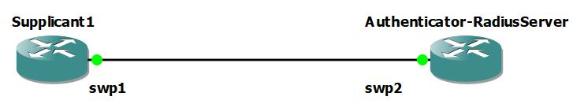

# IEEE 802.1x Dockerized Environment

## Introduction

Due to the complexity of the IEEE 802.1x configuration we thought it might be helpful to create a simplified
alternative to set up IEEE 802.1X on one's host machine. This section will cover a Docker image that contains many of
the necessary installations and configuration changes already in place for IEEE 802.1X.

**NOTE: This image contains the configurations for the Authenticator and the Radius-Server to run on the same device.**

## Docker Installation

To use the IEEE 802.1X Docker image, you will need to have Docker installed

If Docker is not already installed on the device that will act as the Authenticator and the FreeRADIUS-Server
follow the steps below:

1. First, update your existing list of packages:

   ```
   sudo apt update
   ```

2. Next, install a few prerequisite packages which let `apt` use packages over HTTPS:

   ```
   sudo apt install apt-transport-https ca-certificates curl gnupg2 software-properties-common
   ```

3. Then add the GPG key for the official Docker repository to your system:

   ```
   curl -fsSL https://download.docker.com/linux/debian/gpg | sudo apt-key add -
   ```

4. Add the Docker repository to APT sources:

   ```
   sudo add-apt-repository "deb [arch=arm64] https://download.docker.com/linux/debian $(lsb_release -cs) stable"
   ```

5. Next, update the package database with the Docker packages from the newly added repo:

   ```
   sudo apt update
   ```

6. Make sure you are about to install from the Docker repo instead of the default Debian repo:

   ```
   apt-cache policy docker-ce
   ```

   You’ll see an output like this, although the version number for Docker may be different:

   ```
   root@dentlab-infra2:~# apt-cache policy docker-ce
   docker-ce:
     Installed: (none)
     Candidate: 5:26.1.4-1~debian.10~buster
     Version table:
   *** 5:26.1.4-1~debian.10~buster 500
          500 https://download.docker.com/linux/debian buster/stable arm64 Packages
          100 /var/lib/dpkg/status
   ```

7. Finally, install Docker:

   ```
   sudo apt install docker-ce
   ```

8. To check that it’s running use:

   ```
   sudo systemctl status docker
   ```

   Example Output:

   ```
   root@dentlab-infra2:~# systemctl status docker
   ● docker.service - Docker Application Container Engine
      Loaded: loaded (/lib/systemd/system/docker.service; enabled; vendor preset: enabled)
      Active: active (running) since Tue 2024-10-29 01:27:46 UTC; 2h 8min ago
        Docs: https://docs.docker.com
    Main PID: 3786 (dockerd)
       Tasks: 19
      Memory: 3.1G
      CGroup: /system.slice/docker.service
              └─3786 /usr/bin/dockerd -H fd:// --containerd=/run/containerd/containerd.sock

   ```

Congratulations you now have Docker Installed! Create Docker account if you do not have one already at [DockerHub](https://app.docker.com/).

## Pulling the Docker Image

Login to your Docker account:

```
docker login -u ${Username}
```

- At the password prompt, enter your password or a personal access token. You can create a personal access token via your account settings in Dockerhub.

To pull the docker image onto you host machine simply run:

```
docker pull korelu/ieee802-1x-authenticator-and-server:ARM_V1.0
```

Once you pull the docker image run the docker image in a container with your host network

```
docker run --rm --tty --interactive --network host --privileged --name my_host korelu/ieee802-1x-authenticator-and-server:ARM_V1.0
```

## Building the Docker Image

If you would like to build the Docker image yourself the Docker build files used in the Docker image are included below:

[DockerBuildFilesForIEEE802-1x.zip](../PlatformConfigurations/DockerBuildFilesForIEEE802-1X/DockerBuildFilesForIEEE802-1x.zip)

Once installed unzip the files and you should see:

```
root@dentlab-infra2:/etc/docker/DockerBuildFilesForIEEE802-1x# ls
802-1x-tr-mgmt  clients.conf  default  Dockerfile   eap  hostapd.conf  users
```

To build the docker image run the following in the unzipped folder:

```
docker build --network host -t authenticatorAndServerimage .
```

**NOTE: This may take some time**

By default, Docker uses the DNS settings of the host machine.
However, if the build has trouble resolving names like deb.debian.org you may need to specify a DNS resolver.

To do this create or edit the `daemon.json` file within `/etc/docker`. Fill it with the ip address of your DNS resolver.

Example:

```
root@dentlab-infra2:/etc/docker# ls
daemon.json  DockerBuildFilesForIEEE802-1x

root@dentlab-infra2:/etc/docker# cat daemon.json
{
    "dns": ["127.0.0.1", "8.8.8.8"]
}
```

Once you build the Docker image run the docker image in a container with your host network

```
docker run --rm --tty --interactive --network host --privileged --name my_host authenticatorAndServerimage
```

## Review Configuration Files

You will now see all the necessary installations have been added to your device. To complete the configuration do the following:

1. `/etc/hostapd/hostapd.conf`

   - As the network administrator review the `/etc/hostapd/hostapd.conf` file to specify the Network Interface of your
     desired Access Point.

   **You will have to create or specify a bridge to use in the hostapd.conf file that will filter by the learned Mac Addresses in the Forwarding Data Base Table.
   By default, the `br0` is set for usage in the Docker image**

2. `/etc/freeradius/3.0/certs/ca.pem`

   - By default, the docker image configuration is set up for TTLS, as such the server must present a certificate to authenticate
     itself to the client

   **You will also have to share the server certificate authority (`/etc/freeradius/3.0/certs/ca.pem`) file from the server
   with the Supplicant that will request access to the network.**

3. `/etc/freeradius/3.0/users`

   - Review the`/etc/freeradius/3.0/users` file to add or remove users that should be allowed onto the network.

4. `/etc/freeradius/3.0/clients.conf`

   - The `/etc/freeradius/3.0/clients.conf` file is used for configuring devices that are allowed to communicate with the FreeRADIUS server. If you want to set up additional authenticators you may add them here.

5. `/usr/local/bin/802-1x-tr-mgmt`
   - The `/usr/local/bin/802-1x-tr-mgmt` file is a script used for adding/removing Mac Address entries from the Forwarding Database Table.
     It is important for the authenticator as it will adjust device filtering based on the result of the Radius Server.

## Example Usage



Pull or build the Docker container on the **Authenticator-RadiusServer**:

1. Create a bridge and enslave the desired Access Point Interface to the bridge

   ```
   ip link add name br0 type bridge
   ip link set swp2 master br0
   ip link set br0 up
   ip link set swp2 up
   ```

2. Share the `/etc/freeradius/3.0/certs/ca.pem` file with any Supplicants

   ```
   scp ${src} ${dest}
   ```

3. Start hostapd
   ```
   hostapd /etc/hostapd/hostapd.conf -g /var/run/hostapd.pid -d -B
   ```
4. Start the freeradius-Server
   ```
   freeradius -X
   ```
5. Start the hostapd_cli to have ports learn Mac Addresses and add/remove entries from the Forwarding Database Table
   ```
   hostapd_cli -i swp2 -a /usr/local/bin/802-1x-tr-mgmt
   ```

On the **Supplicant** send EAP requests for Network access:

```
wpa_supplicant -c /etc/wpa_supplicant/wpa_supplicant-TTLS.conf -D wired -i swp1
```

Output Example:

```
root@dentlab-infra2:/etc/freeradius/3.0# freeradius -X
FreeRADIUS Version 3.0.17
Copyright (C) 1999-2017 The FreeRADIUS server project and contributors
There is NO warranty; not even for MERCHANTABILITY or FITNESS FOR A
PARTICULAR PURPOSE
You may redistribute copies of FreeRADIUS under the terms of the
GNU General Public License
For more information about these matters, see the file named COPYRIGHT
Starting - reading configuration files ...
including dictionary file /usr/share/freeradius/dictionary
including dictionary file /usr/share/freeradius/dictionary.dhcp
including dictionary file /usr/share/freeradius/dictionary.vqp
[...]
(9) Sent Access-Accept Id 9 from 127.0.0.1:1812 to 127.0.0.1:37455 length 0
(9)   MS-MPPE-Recv-Key = 0x2cc56408030921797d08515c352bb3b9a621c8376a53b23bd09412f49010c16f
(9)   MS-MPPE-Send-Key = 0xb9add5fed4611771adbf2bcfd5db49df266d5d67924a9364f6a6c8d4e11c0bfb
(9)   EAP-Message = 0x03520004
(9)   Message-Authenticator = 0x00000000000000000000000000000000
(9)   User-Name = "IxiaUser1"
(9) Finished request
Waking up in 4.9 seconds.
(0) Cleaning up request packet ID 0 with timestamp +131
(1) Cleaning up request packet ID 1 with timestamp +131
(2) Cleaning up request packet ID 2 with timestamp +131
(3) Cleaning up request packet ID 3 with timestamp +131
(4) Cleaning up request packet ID 4 with timestamp +131
(5) Cleaning up request packet ID 5 with timestamp +131
(6) Cleaning up request packet ID 6 with timestamp +131
(7) Cleaning up request packet ID 7 with timestamp +131
(8) Cleaning up request packet ID 8 with timestamp +131
(9) Cleaning up request packet ID 9 with timestamp +131
Ready to process requests
```
