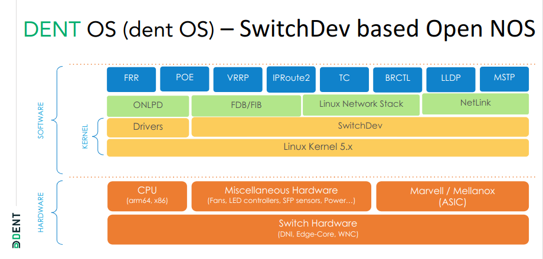

# DENT Network Operating System

[DENT](https://dent.dev/) is an open-source network operating system (NOS) designed for decentralized enterprises. It leverages familiar Linux commands for network configuration, providing an abstracted user experience. With DENT, users can configure switches from different vendors without the need to learn specific commands associated with each.

## Releases

In the first release, Arthur, DENT utilizes the Linux 5.6 Kernel to leverage switchDev, enabling the replacement of proprietary SDKs and NOSes with a standard open Linux interface. It also supports existing Linux toolchains. The ["Arthur" release (v1)](https://github.com/dentproject/dentOS/releases/tag/v1.0), launched in Q4 2020, introduced fundamental features such as L2 Bridge (vlan aware), IPv4 forwarding, Static Routing, Dynamic Routing – BGP, and more. It provided a robust foundation for network configuration and management, enabling seamless integration into decentralized enterprise environments.

In Q1 2022, the ["Beeblebrox" release (v2)](https://github.com/dentproject/dentOS/releases/tag/v2.0) brought significant enhancements to DENT. Notable additions included IPv6, NAT-44 and PT, NAT on pure Layer-3 port, support for configuring 802.1q interfaces, PoE controller integration, Dynamic Routing support, and Scale & Performance Improvements. These advancements fortified DENT's capabilities in handling diverse networking requirements with improved efficiency and scalability.

The "Cynthia" release series marked a significant milestone for DENT. With the [v3.0 release](https://github.com/dentproject/dentOS/releases/tag/v3.0) in Q1 2023, DENT introduced TC Persistence (Petunia), a new Kernel 5.15 (LTS), and support for IEEE 802.1x, QoS, IPv6, IGMP Snooping, and Egress Policer. These features enhanced DENT's security, performance, and compatibility, positioning it as a robust solution for distributed enterprise edge networking.

The subsequent updates in the "Cynthia" series further solidified DENT's capabilities. The [v3.1 release](https://github.com/dentproject/dentOS/releases/tag/v3.1) in Q2 2023 extended test coverage for QoS, ACL, and Bridging/VLAN, ensuring comprehensive validation of these critical features.

Additionally, the [v3.2 release](https://github.com/dentproject/dentOS/releases/tag/v3.2) in Q3 2023 included an update to Debian 10, introduced DentOS VM for enhanced virtualization support, and extended test coverage for IPV6, IGMP Snooping, Egress Policer, Storm Control, and Devlink integration. These updates reflected DENT's commitment to continuous improvement and adaptation to evolving networking needs.

Looking ahead, the upcoming ["DENT 4.0" release](https://github.com/dentproject/dentOS/milestone/6), scheduled for this year, promises a range of new features and improvements. These include DENT Documentation, in-kernel PoE support (in upstream Linux kernel), support for "common" SAI platform, support for edge gateway, a prototype of Yocto-based image for tn48m, debuggability improvements, VXLAN support, migration to Yocto-based build system, dual partitioning, components update, PoE++, update to the latest LTS kernel, PoE LLDP integration, adding support for SAI, SwitchDev to SAI adapter, upgrading to Debian 12, and introducing new HW platforms (Based on OCP Edge Gateway). Stay tuned for the exciting updates and advancements in DENT 4.0, as we continue to push the boundaries of networking innovation.

## Members

For a full list of members, please visit the [DENT home page](https://dent.dev/).

## Specifications

- Utilizes [switchDev](https://github.com/Marvell-switching/switchdev-prestera/wiki) for streamlined switch ASIC integration in the Linux Kernel.
- Treats ASIC and Silicon for Networking/Datapath as standard hardware.
- Simplifies abstractions, API, drivers, and low-level overhead.
- Unifies the community of Silicon Vendors, ODM, SI, OEM, End Users.
- Addresses Networking Operating System challenges for Distributed Enterprise Edge.
- Expands into other use cases such as Enterprise Datacenter, ensuring versatility and scalability in diverse networking environments.
